# **Method 1: The easiest but most annoying way**

###  1. Check the description & instructions of homework in homework repo. (README)   

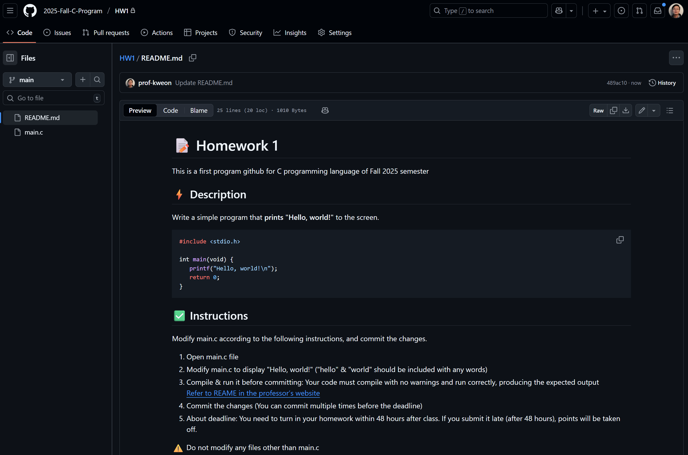

###  2. Open main.c in homework repo.  

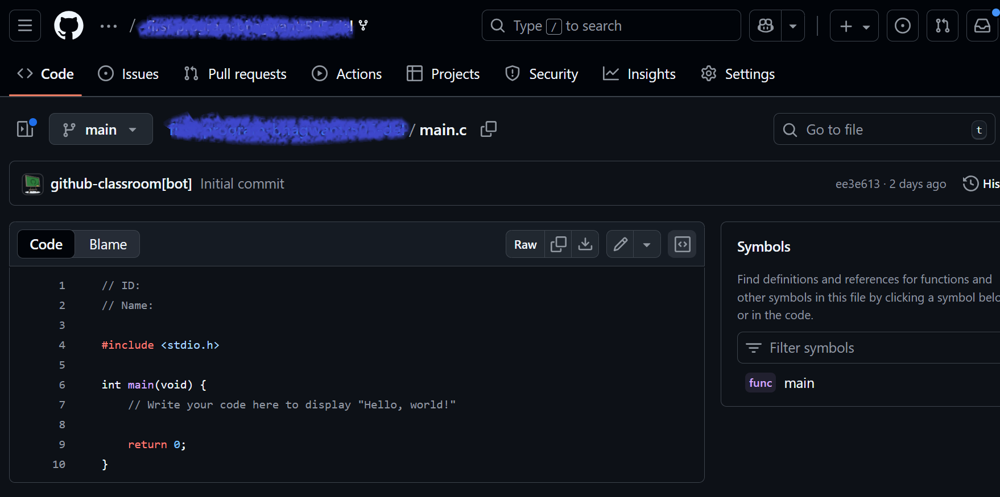

###  3. Copy all codes of main.c in homework repo.  

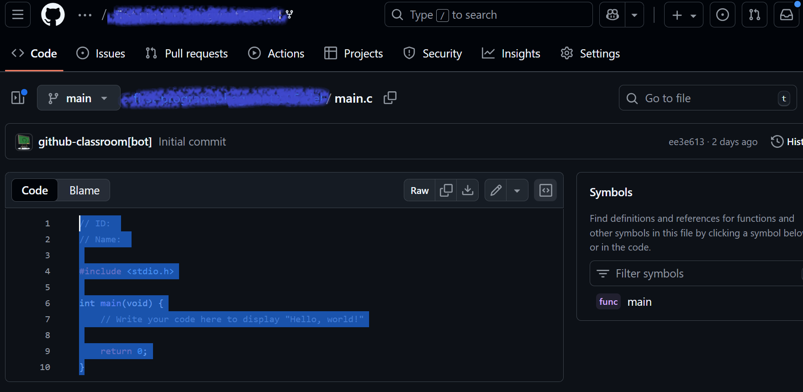

###  4. Prepare one project (just select the folder) & create main.c file in VSC.  

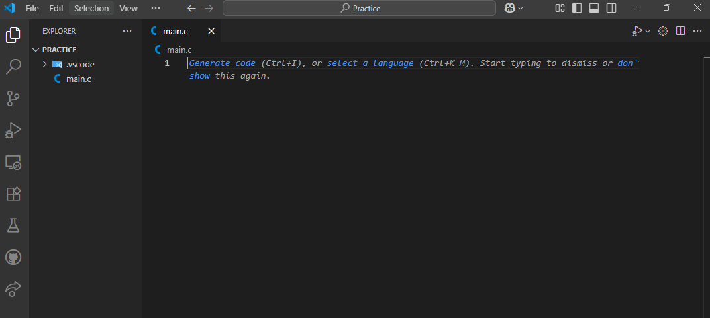

###  5. Paste all codes of homework in main.c of VSC project.    

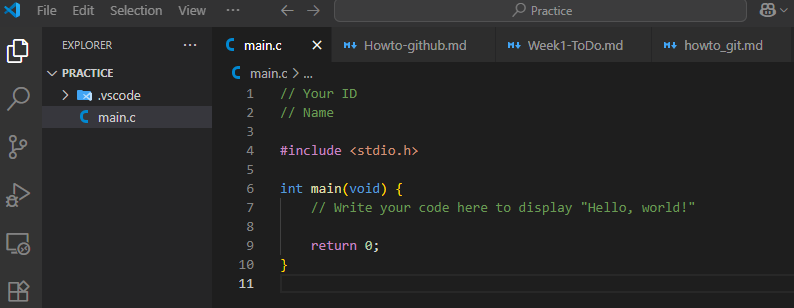

###  6. Modify main.c (Refer to the README.md in the homework repo for the homework description and instructions)

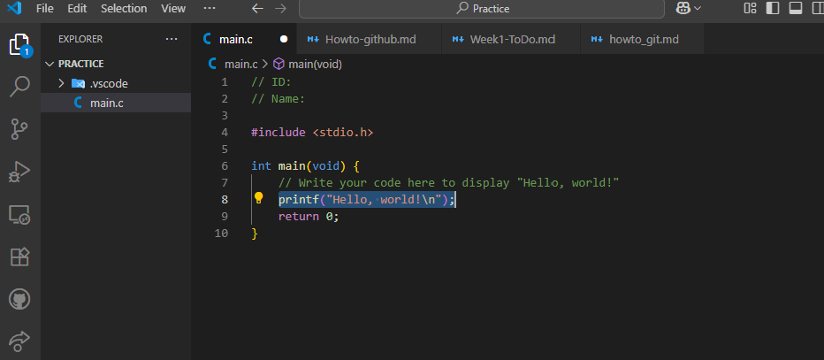  

###  7. Verify your modification in the VSC terminal (save files first, then compile & run it)  

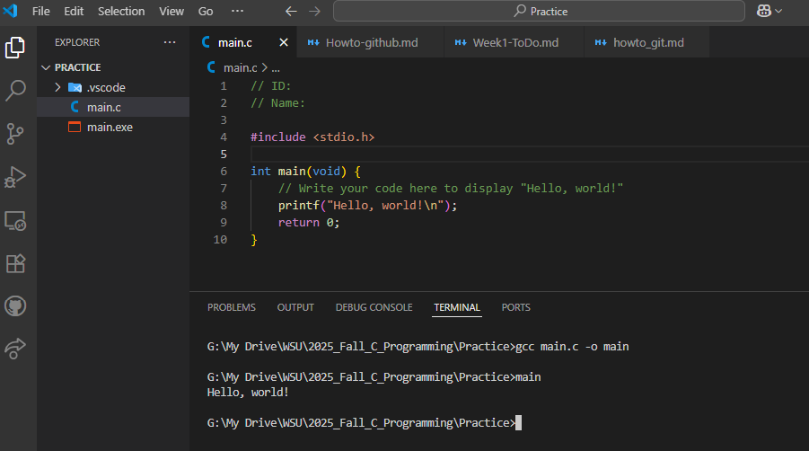  

###  8. Copy all codes of VSC.  

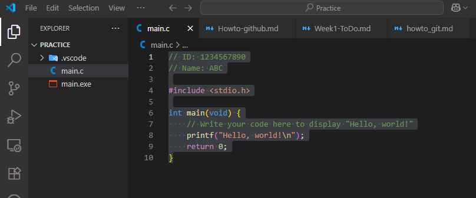

###  9. Click the 'pencil' icon to edit main.c in homework repo.

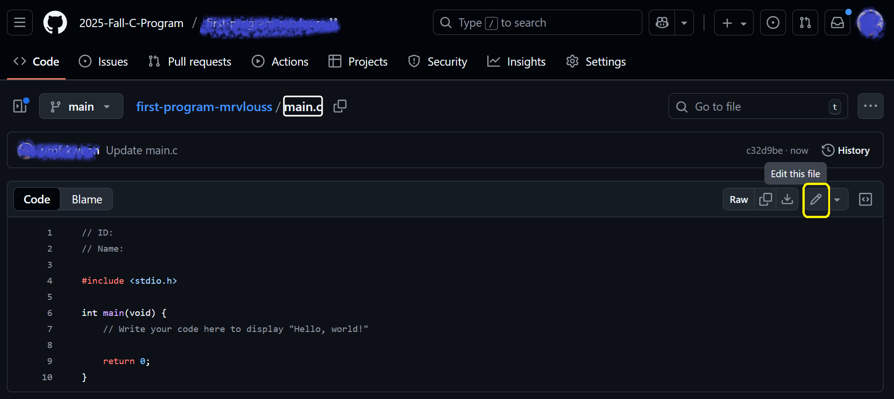  

###  10. Paste all codes in main.c of homework repo.

  

###  11. Press 'Commit changes' button in homework repo. 

###  12. Press 'Commit changes' button one more time in homework repo. 

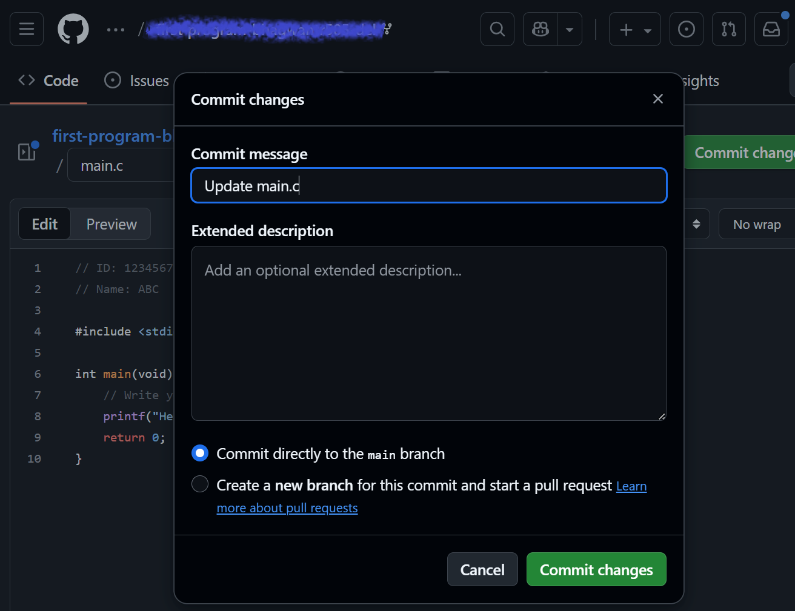

###  13. Check success sign (✔) after a few seconds. DONE

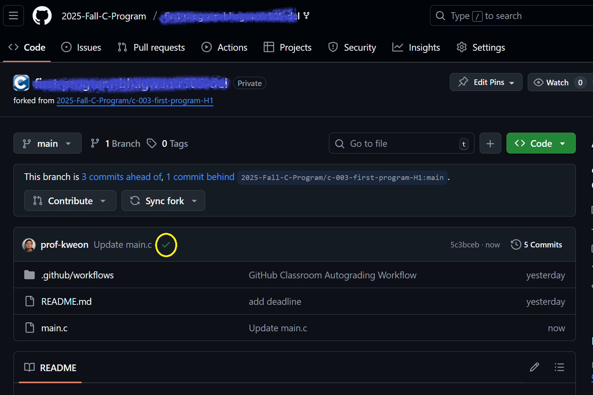

---

## Failure case

###  13. If you got failure sign (✘) after a few seconds, click 'x' icon

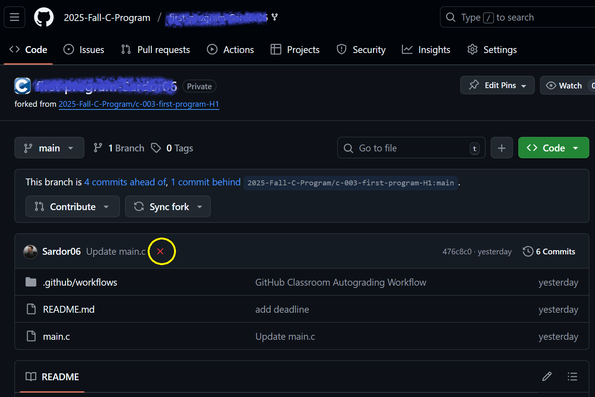  

###  14. Click 'detail' button to check errors

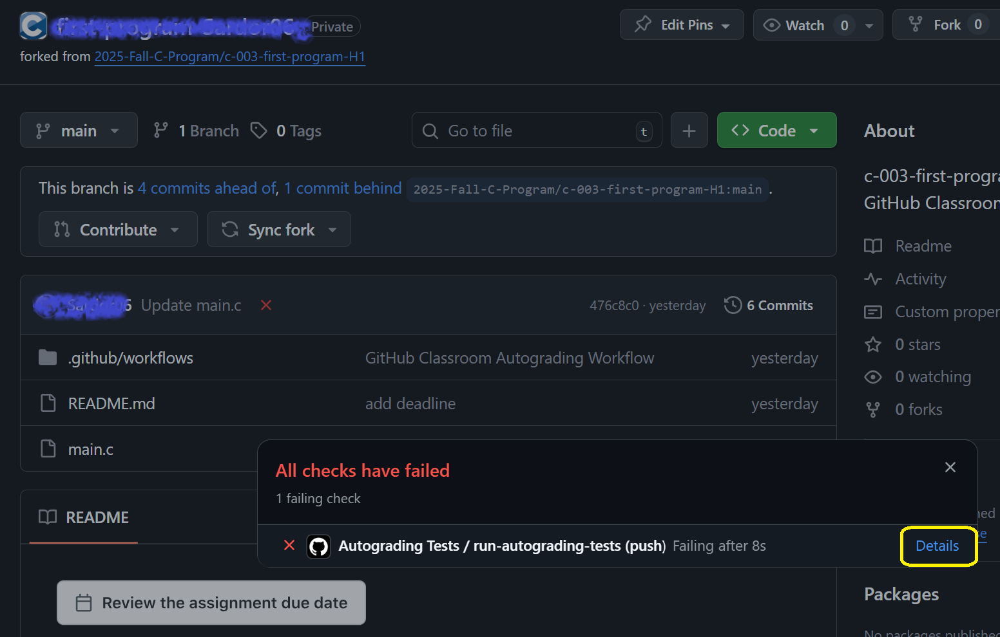  

###  15. Check error information, then modify your code & do again from step 6.  

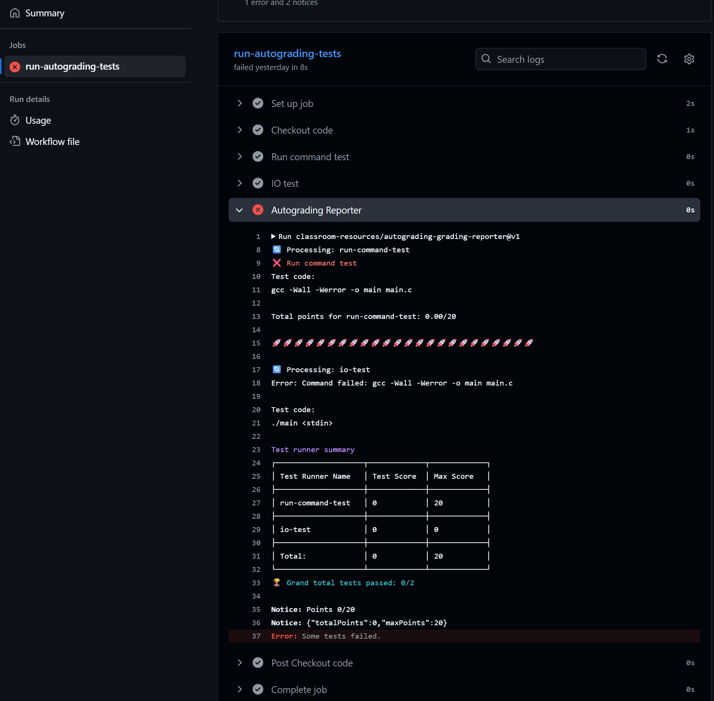  
